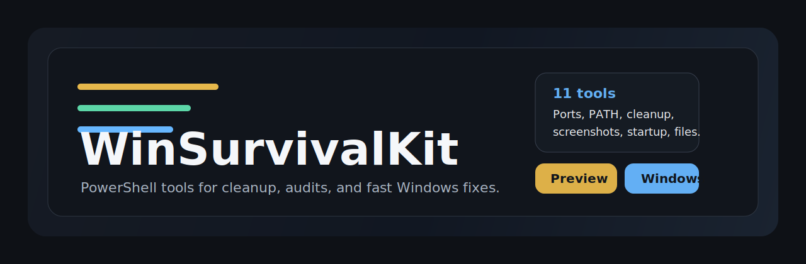
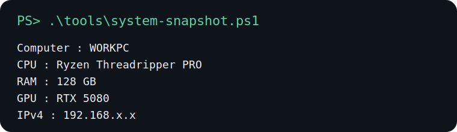
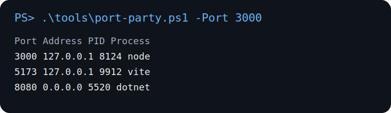
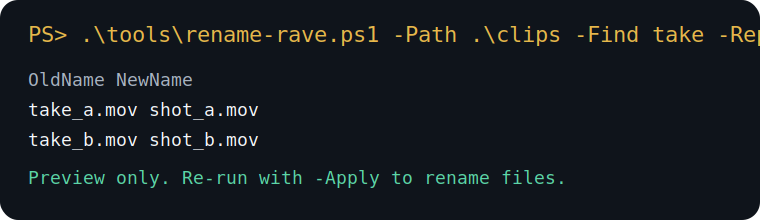
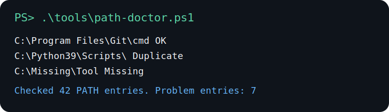

# WinSurvivalKit




Tiny PowerShell utilities for annoying Windows desktop chores.

Created by **Andrew Angulo** and published by **[@DarkCatharsis013](https://github.com/DarkCatharsis013)**.

This repo is intentionally small: no installers, no GUI framework, no dependency chain, just useful scripts you can clone and run.

Anything that mutates files or processes defaults to preview-first behavior.

Tiny but useful PowerShell tools for Windows: ports, PATH cleanup, startup audit, batch renaming, temp cleanup, clipboard cleanup, screenshot sorting, and machine snapshots.

## Demo Gallery

| Tool | Demo |
| --- | --- |
| `system-snapshot.ps1` |  |
| `port-party.ps1` |  |
| `rename-rave.ps1` |  |
| `path-doctor.ps1` |  |

More demo cards live in [`assets/demos`](./assets/demos).

## Vibe

- Windows-first, not cross-platform-by-force
- Useful in five seconds, not after a setup guide
- Safe defaults for anything destructive
- Small enough to fork and personalize

## Featured Commands

```powershell
.\tools\system-snapshot.ps1
.\tools\path-doctor.ps1
.\tools\port-party.ps1 -Port 3000
.\tools\rename-rave.ps1 -Path .\clips -Find "take" -Replace "shot"
.\tools\screenshot-sweeper.ps1 -Path "$env:USERPROFILE\Pictures\Screenshots"
```

## Quick Start

```powershell
git clone https://github.com/DarkCatharsis013/WinSurvivalKit.git
cd WinSurvivalKit
dotnet run --project .\Launcher\WinSurvivalKit.Launcher.csproj
```

The main launcher is the Windows app source in [Launcher/WinSurvivalKit.Launcher.csproj](/C:/Users/Andre/Desktop/windows-fun-tools/Launcher/WinSurvivalKit.Launcher.csproj). Run it with `dotnet run` during development, or publish it as a normal Windows executable. This avoids the old batch-file-to-PowerShell launch pattern that antivirus tools can flag.

Examples:

```powershell
dotnet run --project .\Launcher\WinSurvivalKit.Launcher.csproj
dotnet publish .\Launcher\WinSurvivalKit.Launcher.csproj -c Release -r win-x64 --self-contained true -p:PublishSingleFile=true -o .\artifacts\single-file
```

That publish command produces a standalone launcher executable in `artifacts\single-file\WinSurvivalKit.exe`.

## Downloads

Use the GitHub Releases page if you just want the launcher EXE and do not want to build locally.

You can create a release artifact in two ways:

```text
1. Push a tag like v1.0.0
2. Run the "Release WinSurvivalKit" GitHub Actions workflow manually
```

The release workflow builds `WinSurvivalKit-win-x64.zip` and attaches it to the GitHub release.

If you prefer a terminal-first workflow:

```powershell
.\tools\system-snapshot.ps1
.\tools\port-party.ps1 -Port 3000
```

If Windows blocks script execution in your shell:

```powershell
Set-ExecutionPolicy -Scope Process Bypass
```

## Tools

### `port-party.ps1`

List listening ports with process names, or kill the process bound to a port when you explicitly ask for it.

```powershell
.\tools\port-party.ps1
.\tools\port-party.ps1 -Port 3000
.\tools\port-party.ps1 -Port 3000 -Kill
```

### `path-doctor.ps1`

Audit the current `PATH` for duplicates, missing folders, and suspicious quoted entries.

```powershell
.\tools\path-doctor.ps1
.\tools\path-doctor.ps1 -Scope Machine
```

### `rename-rave.ps1`

Preview and apply batch renames with prefix, suffix, search/replace, and numbering.

```powershell
.\tools\rename-rave.ps1 -Path .\clips -Prefix demo_
.\tools\rename-rave.ps1 -Path .\clips -Find "take" -Replace "shot" -StartNumber 10 -Apply
```

### `junk-drawer.ps1`

Preview or clear temp files from common Windows temp locations.

```powershell
.\tools\junk-drawer.ps1
.\tools\junk-drawer.ps1 -IncludeWindowsTemp
.\tools\junk-drawer.ps1 -Delete -IncludeWindowsTemp
```

### `clipboard-carwash.ps1`

Clean clipboard text by trimming whitespace, normalizing line endings, collapsing blank lines, or converting smart quotes.

```powershell
.\tools\clipboard-carwash.ps1
.\tools\clipboard-carwash.ps1 -TrimLines -CollapseBlankLines -WriteBack
```

### `screenshot-sweeper.ps1`

Preview or sort screenshots and images into dated subfolders.

```powershell
.\tools\screenshot-sweeper.ps1 -Path "$env:USERPROFILE\Desktop"
.\tools\screenshot-sweeper.ps1 -Path "$env:USERPROFILE\Pictures\Screenshots" -Apply
```

### `system-snapshot.ps1`

Print a compact machine summary for CPU, RAM, GPU, disks, OS, uptime, and local IPv4 addresses.

```powershell
.\tools\system-snapshot.ps1
```

### `startup-snoop.ps1`

Audit common Windows startup locations and registry run keys to see what launches on login.

```powershell
.\tools\startup-snoop.ps1
```

### `big-file-bouncer.ps1`

Find the biggest files in a folder before your drive quietly fills up.

```powershell
.\tools\big-file-bouncer.ps1 -Path "$env:USERPROFILE\Downloads"
.\tools\big-file-bouncer.ps1 -Path . -Top 25 -Recurse
```

### `extension-radar.ps1`

See which file types dominate a folder by count and total size.

```powershell
.\tools\extension-radar.ps1 -Path "$env:USERPROFILE\Desktop"
```

### `process-parade.ps1`

Show the biggest running processes by RAM or CPU time.

```powershell
.\tools\process-parade.ps1
.\tools\process-parade.ps1 -SortBy CPU -Top 20
```

### `desktop-radar.ps1`

Summarize what is sitting on your desktop and flag the biggest files.

```powershell
.\tools\desktop-radar.ps1
.\tools\desktop-radar.ps1 -Path "$env:USERPROFILE\Downloads"
```

## Why This Repo Works Publicly

- Windows-specific enough to be useful.
- No external dependencies.
- Safe defaults for anything destructive.
- Easy to fork, extend, or turn into a larger toolbox.

## CI

GitHub Actions parses every `.ps1` file on push and pull request to catch PowerShell syntax errors early.

## Release Notes

- Preview-first behavior for risky operations
- No external dependencies
- Terminal-style demo assets ready for GitHub previews and social sharing

## Requirements

- PowerShell 5.1+ or PowerShell 7+
- Windows
- .NET 9 SDK for the launcher app

## Positioning

Tiny Windows utilities that solve annoying desktop problems without requiring a full app install.

## Credit

Created and maintained by **Andrew Angulo** and **[@DarkCatharsis013](https://github.com/DarkCatharsis013)**.
